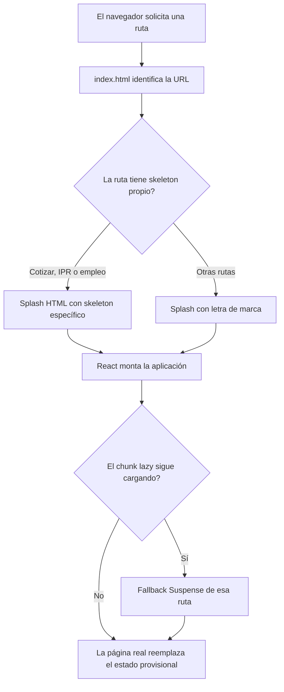

# Bitácora de carga y descubrimiento para IA

Esta guía resume las decisiones de carga y descubrimiento tratadas durante la implementación: loader de marca, skeleton screens, formularios, `llms.txt`, ARD y publicación en Vercel. Sirve como referencia técnica y material de estudio. No documenta una API para ejecutar formularios: las rutas de cotización, IPR y empleo son interfaces web para personas.

## Archivos actuales

| Archivo fuente | URL esperada | Estado |
|---|---|---|
| `public/llms.txt` | `/llms.txt` | Markdown con H1, resumen y enlaces a las páginas principales. |
| `public/ai-catalog.json` | `/ai-catalog.json` | JSON sintácticamente válido con una estructura propia; no es todavía un manifiesto ARD. |

Vite copia los archivos de `public/` a la raíz de `dist/`. La regla SPA de [`vercel.json`](../vercel.json) reescribe rutas hacia `index.html` cuando no se encuentra un recurso estático. Si una URL de manifiesto devuelve HTML, el archivo no está disponible en esa ruta del despliegue, se está consultando una ruta distinta o el despliegue aún no contiene el archivo.

## `llms.txt`

La propuesta de [llms.txt](https://llmstxt.org/) usa Markdown. El H1 con el nombre del sitio es obligatorio; el resumen en blockquote y las secciones con enlaces ayudan a orientar a los asistentes.

El archivo del proyecto enlaza estas rutas:

- Inicio: `/`
- Estimador de cuotas: `/cotizar`
- Consulta IPR: `/ipr`
- Postulaciones: `/empleo`

Para agregar una página, actualiza `public/llms.txt` y confirma que el destino exista en React Router.

## ARD y `ai-catalog.json`

El auditor citado sigue la especificación [Agentic Resource Discovery (ARD)](https://agenticresourcediscovery.org/spec/). En ARD v0.91, la ubicación normativa del manifiesto es:

```text
/.well-known/ard.json
```

El nombre anterior `/.well-known/ai-catalog.json` puede ser consultado por compatibilidad, pero los clientes actuales no están obligados a buscarlo. Un archivo en `/ai-catalog.json` tampoco sustituye por sí solo el endpoint normativo.

El manifiesto es un objeto con `entries`, no un objeto arbitrario con `site`, `catalogs` y `tools`:

```json
{
  "entries": [
    {
      "identifier": "urn:air:<dominio>:<namespace>:<recurso>",
      "displayName": "Nombre del recurso",
      "type": "<media-type>",
      "url": "https://<dominio>/<recurso>",
      "description": "Descripción breve",
      "representativeQueries": [
        "Consulta de ejemplo uno",
        "Consulta de ejemplo dos"
      ],
      "capabilities": ["capacidad-1"]
    }
  ]
}
```

El ejemplo es una plantilla, no JSON listo para publicar: reemplaza los marcadores por valores reales. Cada entrada necesita `identifier`, `displayName`, `type` y exactamente uno de `url` o `data`. `identifier` debe usar un URN anclado a un dominio, y `url` debe apuntar al artefacto real. ARD recomienda entre dos y cinco `representativeQueries`.

### Pendiente para publicar ARD

1. Confirmar el dominio canónico de producción. No uses un dominio supuesto en el URN ni en las URL absolutas.
2. Decidir qué recurso agéntico se está publicando. Los formularios actuales son páginas web y no ofrecen por sí mismos una herramienta MCP, un agente A2A ni una API invocable.
3. Crear `public/.well-known/ard.json` con una lista `entries` que cumpla el esquema oficial.
4. Si una herramienta heredada exige `/.well-known/ai-catalog.json`, publicar ahí un manifiesto equivalente como alias de compatibilidad.
5. Compilar y desplegar; comprobar la respuesta HTTP en producción antes de ejecutar de nuevo el auditor.

## Verificación

### Build local

```bash
npm run build
```

En PowerShell, comprueba los artefactos estaticos generados:

```powershell
Test-Path dist/llms.txt
Test-Path dist/.well-known/ard.json
```

La segunda comprobación debe ser `True` después de crear el manifiesto ARD.

### Produccion

Reemplaza `<dominio>` por el host canónico:

```bash
curl -i https://<dominio>/llms.txt
curl -i https://<dominio>/.well-known/ard.json
```

Comprueba el código `200`, que el tipo de contenido corresponda al recurso y que el cuerpo sea Markdown o JSON, respectivamente. Si la respuesta comienza con `<!doctype html>`, Vercel está entregando la SPA en lugar del archivo: confirma la ruta, que el archivo llegó a `dist/` y que el último commit ya fue desplegado. Ajusta los rewrites solo si el archivo estático existente sigue siendo interceptado.

## Resumen de la implementación

### Loader de marca

- `src/components/ui/Loader.jsx` y `Loader.css` crean un loader reutilizable con la letra Fujitec WebP dentro de un medallón blanco.
- El medallón salta y se comprime al aterrizar; la letra se reduce brevemente. Es una animación de marca, no un spinner: no gira ni lleva el punto rojo que se descartó.
- `role="status"`, `aria-live="polite"` y el texto oculto permiten anunciar la carga a lectores de pantalla.
- `prefers-reduced-motion` desactiva el movimiento cuando el sistema lo solicita.
- `index.html` incluye un splash estático porque React aún no está disponible antes de cargar el bundle. Inicio y rutas no cubiertas por skeleton usan la marca.

### Skeletons específicos

- `src/components/ui/PageSkeleton.jsx` dibuja tres variantes grises: cotizador, IPR y empleo.
- El cotizador reserva encabezado, stepper y campos; IPR reserva consulta, botón y resultado; empleo reserva campos personales, chips de maniobras, carga de CV y botón.
- `src/routes/AppRoutes.jsx` tiene un `Suspense` por ruta. Así, cada importación `lazy()` usa su skeleton correspondiente mientras descarga el chunk.
- `index.html` repite la silueta HTML para cubrir la primera carga, antes de que React monte. Si cambia la forma de una página, hay que mantener sincronizada su variante en `PageSkeleton.jsx` y en `index.html`.
- Las barras de título reservan una o dos líneas de acuerdo con cada página y se ajustan en móvil para reducir el salto cuando aparece el título real.

### Esperas durante peticiones

- `src/components/ui/SkeletonCard.jsx` y `SkeletonCard.css` implementan tarjetas grises reutilizables, en tamaño normal y compacto.
- IPR muestra una tarjeta normal durante la consulta. Cotización y empleo muestran una compacta durante el envío; los campos siguen visibles y el botón se deshabilita para evitar envíos duplicados.
- IPR usa `try/catch/finally`: muestra errores de red y siempre apaga `loading`, tanto en éxito como en error.
- **Límite actual de IPR:** registra el RAE y calcula un resultado de demostración a 45 días. No consulta una fuente oficial de vencimientos; debe describirse como orientación, no como verificación oficial.
- No se añadió retraso anti-parpadeo. Si una petición muy rápida hace que el skeleton aparezca y desaparezca de forma molesta, se puede retrasar su presentación y mantenerlo visible un tiempo mínimo.

## Flujo de carga



Las esperas de red dentro de una página son independientes de `Suspense`: se controlan con estados como `loading` o `isSubmitting`.

## Glosario para estudiar

| Término | Significado en este proyecto |
|---|---|
| **Loader** | Indicador de actividad; aquí, el medallón de marca animado. |
| **Splash / boot screen** | Pantalla provisional del HTML que aparece antes de que React arranque. |
| **Skeleton screen** | Silueta gris que reserva la forma del contenido próximo; no es un spinner ni contiene datos reales. |
| **Placeholder** | Espacio temporal que ocupa el lugar de un elemento aún no disponible. |
| **SPA** | Aplicación de una sola página; React Router cambia de vista sin recargar todo el documento. |
| **Lazy loading** | Descarga diferida de una página o chunk al visitar su ruta. |
| **`Suspense` / fallback** | React muestra el fallback mientras un componente suspendido, como uno creado con `lazy()`, termina de cargar. |
| **Estado de carga** | Estado temporal (`loading`, `isSubmitting`) que controla feedback, botones deshabilitados y errores. |
| **`transform` / `opacity`** | Propiedades CSS usadas para animaciones de bajo costo, como el salto del medallón y el pulso gris. |
| **Reduced motion** | Preferencia del sistema operativo para reducir o desactivar animaciones. |
| **ARIA** | Atributos que comunican estado y contenido a tecnologías de asistencia; aquí se usan `role="status"` y `aria-live`. |
| **`public/` / `dist/`** | `public/` contiene estáticos de origen; Vite los copia a la raíz de `dist/` durante el build. |
| **Rewrite SPA** | Regla de Vercel que envía rutas no encontradas a `index.html` para que React Router las resuelva. |
| **Endpoint** | URL que recibe una petición HTTP, por ejemplo `/llms.txt`. |
| **`Content-Type`** | Encabezado HTTP que declara el formato de la respuesta, como `text/plain` o `application/json`. |
| **JSON válido vs. schema válido** | JSON válido se puede parsear; schema válido además cumple campos, tipos y reglas de un contrato. |
| **ARD** | Agentic Resource Discovery, especificación para describir y descubrir recursos agénticos. |
| **Manifiesto ARD** | Documento con `entries`; cada entrada requiere identificador, nombre, tipo y exactamente una referencia `url` o datos `data`. |
| **JSON-LD** | JSON con términos enlazados a vocabularios; ARD lo usa para dar significado interoperable a las entradas. |
| **URN** | Identificador persistente; ARD usa `urn:air:<dominio>:<namespace>:<recurso>`. No es una URL de navegación. |
| **`representativeQueries`** | Frases de ejemplo que expresan qué buscaría una persona para encontrar un recurso. |
| **`capabilities`** | Tokens breves para filtrar recursos; no crean por sí mismos una API ejecutable. |
| **Dominio canónico** | Host público oficial que se usa en URLs absolutas e identidad de publicación; está pendiente de confirmar. |

## Estado y siguientes pasos

### Hecho

- `public/llms.txt` tiene título, resumen y enlaces a las páginas principales.
- Hay loader de marca y skeletons específicos para las tres rutas de formularios.
- IPR muestra estado de carga y error; los envíos del cotizador y empleo muestran skeleton compacto.
- `README.md` sirve como guía principal y `estructura.txt` excluye `public/wa-assistant-rag`, `node_modules`, `dist` y `.git`.

### Pendiente

- Confirmar el dominio público canónico.
- Decidir qué recurso agéntico real se quiere descubrir: los formularios actuales son páginas para personas, no herramientas MCP/A2A ni APIs invocables.
- Crear `public/.well-known/ard.json` con el formato ARD oficial y validarlo con su esquema.
- Desplegar y comprobar en producción HTTP `200`, `Content-Type` y cuerpo JSON, no HTML.
- Determinar si el auditor requiere también el alias heredado `/.well-known/ai-catalog.json`.

## Preguntas de repaso

1. ¿En qué se diferencian un loader y un skeleton screen?
2. ¿Por qué una ruta necesita un fallback `Suspense` además del splash de `index.html`?
3. ¿Qué significa que un JSON sea sintácticamente válido pero no cumpla un schema?
4. ¿Qué indica que la respuesta de `/ai-catalog.json` empieza con `<!doctype html>`?
5. ¿Qué diferencia hay entre un formulario web y una herramienta MCP/A2A invocable?
6. ¿Qué dato real se necesita antes de formar el URN ARD y las URLs absolutas?

## Fuentes

- [Propuesta llms.txt](https://llmstxt.org/)
- [Especificacion ARD](https://agenticresourcediscovery.org/spec/)
- [Rewrites de Vercel](https://vercel.com/docs/rewrites)